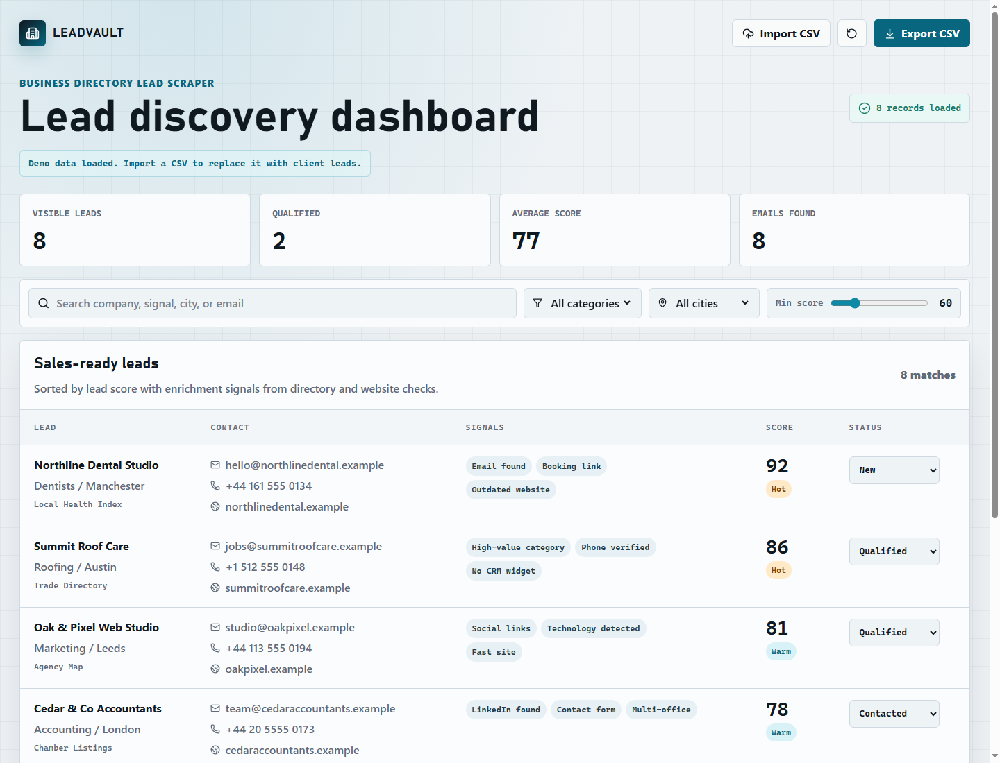

# Business Directory Lead Scraper Dashboard

A Level 6 lead-generation dashboard that shows how scraped business directory data can become a practical sales workspace. The app lets a client review enriched leads, filter by market, adjust quality thresholds, update outreach status, and export the current view as a CSV.



## Why This Project Exists

Most scraper demos stop at a raw spreadsheet. This project demonstrates the next step: a client-facing dashboard where scraped records become usable sales intelligence.

It is designed as a portfolio-ready Upwork demo for a **Business Directory Lead Scraper** service.

## Features

- Search leads by company, category, city, source, email, or enrichment signal
- Filter by business category and city
- Adjust the minimum lead score with a range control
- Review enrichment signals like email found, booking link, social links, outdated website, and CRM gaps
- Import real lead files from CSV
- Persist imported leads and status changes in browser storage
- Update lead status across New, Contacted, Qualified, and Rejected
- Export the filtered result set to CSV
- Track operational metrics including visible leads, qualified leads, average score, and emails found
- Responsive dashboard layout for desktop and smaller screens

## Tech Stack

- React
- TypeScript
- Vite
- Convex for the backend/database foundation
- PapaParse for CSV import
- Zod for import validation
- Lucide React icons
- CSS modules through standard app styles

## Getting Started

Install dependencies:

```bash
npm install
```

Create local environment variables:

```bash
cp .env.example .env.local
```

Configure Convex:

```bash
npm run convex:dev
```

The first Convex run will prompt you to log in, create or select a project, and write the deployment values used by the app.

Run the development server:

```bash
npm run dev
```

Or run Convex and Vite together:

```bash
npm run dev:full
```

Create a production build:

```bash
npm run build
```

Preview the production build:

```bash
npm run preview
```

## Demo Workflow

1. Open the dashboard.
2. Click **Import CSV** and select `sample-leads.csv`.
3. Search for a business type, city, email, or signal.
4. Filter by category or city.
5. Raise or lower the minimum score.
6. Change a lead status.
7. Refresh the browser to confirm imported leads and statuses persist.
8. Export the filtered leads to CSV.

## CSV Import Format

The importer accepts friendly column names and normalizes them internally.

Recommended headers:

```csv
Business Name,Category,City,Directory,Website,Email,Phone,Address,Score,Status,Signals,Source URL
```

Supported aliases include:

- `Business Name`, `Company`, or `Name`
- `Category`, `Industry`, or `Business Type`
- `City`, `Location`, `Town`, or `Market`
- `Directory`, `Source`, or `Lead Source`
- `Phone`, `Phone Number`, or `Telephone`
- `Source URL`, `Directory URL`, or `Listing URL`

`Signals` can be separated with semicolons, for example:

```csv
Email found; Booking link; Outdated website
```

If `Score` is missing, the app calculates a score from available email, phone, website, source URL, and enrichment signals.

## Convex Data Model

The backend schema lives in `convex/schema.ts` and defines the foundation for the production pipeline:

- `leads`: normalized lead records, status, score, source references, and deduplication key
- `imports`: CSV import batches and import result counts
- `scrapeRuns`: scraper job metadata, progress counts, status, and logs
- `leadSources`: configured source directories or CSV sources

The current UI still works with browser persistence while the Convex migration is phased in. The next phase replaces local lead state with Convex queries and mutations.

## Production Roadmap

This frontend is ready to connect to a real scraper pipeline. A production version would typically add:

- Directory-specific scraper adapters
- Job queue for scraping runs
- Backend API and database storage for leads and scrape history
- Deduplication across directories
- Website crawling for email, social, and contact-page enrichment
- Lead scoring rules configurable per client
- Google Sheets, Airtable, HubSpot, or Pipedrive export
- Authentication and saved client workspaces

## Client Pitch

> I can build a lead scraper that collects businesses from directories, enriches each lead by visiting their website, extracts emails and contact signals, removes duplicates, scores lead quality, and gives you a dashboard where you can filter, qualify, and export the best leads.

## Project Status

This is a polished frontend demo with mock data. It is structured to demonstrate the product experience before connecting a real scraping backend.
